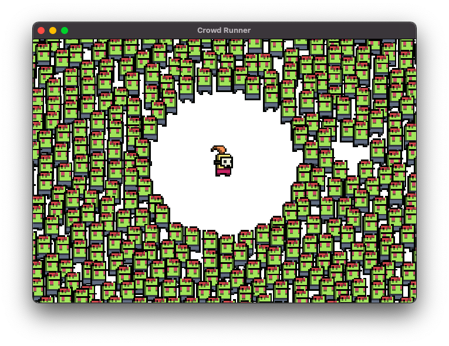

# Crowd Runner Example
_Defold_ example with up to 32765 entities support with simple physics

#### [Click here to check the HTML example](https://insality.github.io/crowd-runner-defold/)
- Profiler is not working in HTML release build

### About
The example was created from this video:

And we tried to build the same stuff on _Defold_. For now it's kind of example and benchmark to see how we can use a lot of entities at once time.

The example have two toggler:
- `Skip update` - the entities, which far away from player call update less frequently (up to zero times)
- `Draw outside` - the sprite's entities which far away from player is disabled. You can check how it's affects on game performance

### Control:
WASD or touch the screen for move
P - Profiler
Or use on-screen buttons

Sprites generated by pixeldudesmaker: https://0x72.itch.io/pixeldudesmaker
